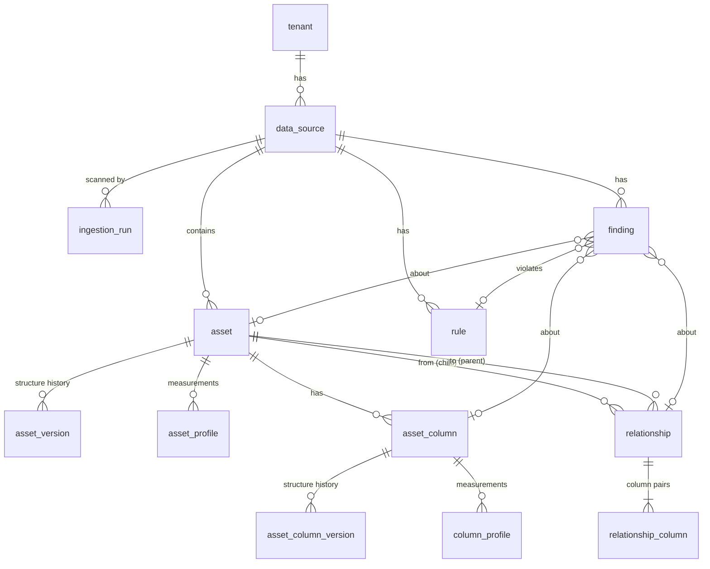

# Metadata store design (Stage 1.1)

*The database **our tool** uses to remember everything it learns about customer databases. Code: `src/ai_data_engineer/graph/`. Migration: `src/ai_data_engineer/migrations/versions/v0001_initial_schema.py`. Rationale: [ADR 0004](../decisions/0004-identity-version-profile.md).*

Nothing in this layer touches a customer database. Adapters (Stage 1.3) read customer databases and write here; discovery and detection (Stages 1.4–1.5) read from here.

---

## 1. The big picture

Three ideas carry the whole design:

1. **Identity vs. version vs. profile** (section 2). We separate *what a thing is*, *what shape it has*, and *what we measured*.
2. **Everything points at stable keys.** Relationships, rules and findings reference `asset_key` / `column_key`, which never change. So history can grow forever without breaking links.
3. **Every row belongs to a tenant** (`tenant_id`). A self-hosted install has one tenant; SaaS later has many.

---

## 2. Identity, version, profile

Take the column `orders.amount` over four nightly scans:

| Scan | What happened in the customer DB | `asset_column` (identity) | `asset_column_version` (structure) | `column_profile` (measurements) |
|---|---|---|---|---|
| Mon | first seen, `numeric(10,2)` | **created** (`column_key = K`) | v1: `numeric(10,2)`, from Mon, to — | Mon: null_rate 0.1% |
| Tue | nothing changed structurally | `last_seen_at` = Tue | *(no new row)* | Tue: null_rate 0.1% |
| Wed | someone changed it to `text` | `last_seen_at` = Wed | v1 closed (to Wed); **v2**: `text`, from Wed | Wed: null_rate 0.1% |
| Thu | column dropped | `deleted_at` = Thu | v2 closed (to Thu) | *(none)* |

What this gives us:
- **Type drift** on Wed = "v1 → v2, `decimal` → `string`". The detector just reads the versions.
- **Null-rate history** is a clean series in `column_profile`, unaffected by structural changes.
- If `amount` comes back on Fri, it is **the same `column_key = K`**: old findings and relationships still attach to it, and the history shows the gap.

Asset-level works the same way: `asset` → `asset_version` (kind, primary key, indexes, unique constraints, declared FKs, comment) → `asset_profile` (row count, size, last-modified time for freshness).

### The "one current version" guarantee
`valid_to IS NULL` means "current". A **partial unique index** (`ux_asset_version_current`, `ux_asset_column_version_current`) makes the database itself refuse a second current version. A check constraint makes sure `valid_to ≥ valid_from`.

### Writing history: `graph/versioning.py`
Adapters never insert `asset*` rows directly. They build an `AssetObservation` ("this is what table X looks like right now") and call:

- **`record_asset(session, run, observation)`**
  - new table/column → identity + first version
  - unchanged → only `last_seen_at` moves; **no new rows** (idempotent)
  - changed → close the current version, open a new one
  - column missing from the observation → column `deleted_at` set, version closed
  - table/column reappears → same identity, `deleted_at` cleared, new version
  - returns a `RecordResult` (created / changed / columns added, changed, removed)
- **`mark_missing_assets(session, run, seen_asset_keys)`**: after a **full** scan, tables not seen are marked deleted (with their columns).

Details that prevent false "changes":
- Index, unique-constraint and FK lists are compared **order-insensitively** and after a JSON round-trip, so `("a",)` vs `["a"]` or a different key order never counts as a change.
- Primary-key column order **is** significant, because it is for composite keys.
- Observations must be recorded in time order; an older observation than the current version raises an error instead of corrupting history.

---

## 3. Table reference

### `tenant`
One customer. `name` unique.

### `data_source`
A database we watch.

| Column | Meaning |
|---|---|
| `kind` | `postgres`, `mysql`, `sqlserver`, `oracle`, `snowflake`, `bigquery`, `databricks` |
| `connection_ref` | **Where** to find credentials (env var / secrets-manager key). Credentials themselves are never stored. |
| `settings` | Per-source behaviour (JSON), e.g. sampling limits, whether top values may be stored |
| `disabled_at` | Set when monitoring is paused |

Unique: (`tenant_id`, `name`).

### `ingestion_run`
One scan of a source: `status` (`running` / `succeeded` / `partial` / `failed`), `started_at`, `finished_at`, `stats` (JSON counts), `error_message`. Every version and profile row points at the run that produced it. Detection counts runs to handle **cold start** ("only 2 scans so far, not enough history").

### `asset` (identity)
`asset_key` (PK), `data_source_id`, `namespace` (database/catalog), `schema_name`, `name`, `first_seen_at`, `last_seen_at`, `deleted_at`. Unique natural key: (`tenant_id`, `data_source_id`, `namespace`, `schema_name`, `name`).

### `asset_version` (structure history)
`kind` (`table` / `view` / `materialized_view` / `foreign_table` / `other`), `primary_key` (list of column names; empty = **no PK**, a structural finding), `indexes`, `unique_constraints`, `foreign_keys` (declared FKs exactly as the database reports them), `comment`, `properties`, plus `valid_from` / `valid_to` / `ingestion_run_id`.

### `asset_profile` (measurements)
`row_count` (+ `row_count_is_estimate`), `size_bytes`, `last_modified_at` (freshness), `properties`. One per asset per run.

### `asset_column` (identity)
`column_key` (PK), `asset_key`, `name`, `first_seen_at`, `last_seen_at`, `deleted_at`. Unique: (`asset_key`, `name`).

### `asset_column_version` (structure history)
| Column | Meaning |
|---|---|
| `native_type` | Exactly as the database says, e.g. `character varying(255)` |
| `type_family` | Database-neutral family: `string`, `integer`, `decimal`, `float`, `boolean`, `date`, `timestamp`, `time`, `interval`, `binary`, `json`, `uuid`, `array`, `other`. Lets us spot "the same concept stored as `INT` here and `VARCHAR` there", even across different database engines. |
| `is_nullable`, `ordinal_position`, `default_expr`, `comment` | as named |

### `column_profile` (measurements)
| Column | Meaning |
|---|---|
| `row_count`, `null_count`, `null_rate` | `null_rate` is 0–1 (check constraint) |
| `distinct_count`, `distinct_is_approx` | approximate counts are allowed on big tables and flagged |
| `min_repr`, `max_repr` | text representations of extremes |
| `mean`, `stddev`, `avg_length` | numeric / string shape |
| `sample_fraction` | 1.0 = full scan; smaller = sampled (0 < x ≤ 1) |
| `top_values` | `[{value, count}]` for low-cardinality columns, **only if the source allows storing values**; `NULL` = not collected. Needed for "US / USA / United States". |
| `extra` | room for new measurements without a migration |

One per column per run.

### `relationship` + `relationship_column`
A link "child table → parent table", declared or inferred.

| Column | Meaning |
|---|---|
| `from_asset_key` → `to_asset_key` | child (referencing) → parent (referenced), e.g. `orders` → `customers` |
| `kind` | `declared` (a real FK) or `inferred` (discovered; **must** have a `confidence`, DB-enforced) |
| `status` | `proposed` / `confirmed` / `rejected`. Only confirmed relationships are followed by default. |
| `confidence` | 0–1 |
| `signals` | which evidence found it, e.g. `["name_match", "value_inclusion", "query_log_join"]` |
| `evidence` | the numbers behind it (overlap %, join counts, …) |
| `signature` | hash of the column pairs; at most one current relationship per signature per tenant |
| `valid_from` / `valid_to` | relationships have history too |

`relationship_column` holds the column pairs (`ordinal`, `from_column_key`, `to_column_key`), so **composite keys** (common in legacy schemas) work.

### `rule`
An explicit expectation, e.g. `ship_date >= order_date`. `rule_type` (open-ended: `not_null`, `range`, `sql_assertion`, …), `definition` (JSON), target asset/column, `origin` (`system` / `user` / `ai`), `status` (`proposed` / `active` / `rejected` / `disabled`), `confidence`, `evidence`, `created_by`, `reviewed_by`, `reviewed_at`.

**AI rules must carry a confidence** (DB-enforced). They start as `proposed` and run only after a human makes them `active`.

### `finding`
The single output table for every detector.

| Column | Meaning |
|---|---|
| `category` | the taxonomy: `structural`, `relational`, `column_value`, `business_rule`, `time_series`, `row_outlier`, `cross_system`, `semantic`, `db_health` |
| `check_name` | which check produced it, e.g. `null_rate_spike` |
| `fingerprint` | hash of "check + subject"; at most **one active** (`open` / `confirmed`) finding per fingerprint per tenant, so repeated detections update instead of duplicating |
| `severity` | `info` / `low` / `medium` / `high` / `critical` |
| `status` | `open` / `confirmed` / `rejected` / `resolved` |
| `origin` | `system` / `user` / `ai`; AI findings **must** have a `confidence` |
| `asset_key`, `column_key`, `relationship_id`, `rule_id` | what it's about (any combination) |
| `title`, `description`, `evidence` | human-readable with the actual numbers; evidence = baseline, observed value, threshold, queries |
| `first_detected_at`, `last_detected_at`, `first_run_id`, `last_run_id` | lifecycle |
| `resolved_at`, `alerted_at`, `reviewed_by`, `reviewed_at`, `review_note` | resolution, alert suppression, human feedback (the future track record) |

---

## 4. Queries (`graph/queries/`)

| Function | Answers | Used by |
|---|---|---|
| `get_current_structure(session, data_source_id)` | live tables with their current columns (deleted ones excluded), ordered by position | adapters (diffing), auto-documentation |
| `get_column_profile_history(session, column_key, limit=30)` | last N measurements, newest first | statistical checks |
| `get_asset_profile_history(session, asset_key, limit=30)` | last N table measurements | volume / freshness checks |
| `get_connected_assets(session, tenant_id, asset_key, max_depth=3, direction="both", include_proposed=False)` | tables reachable through relationships, with the shortest hop count | impact analysis, relationship map |

`get_connected_assets` is a **recursive SQL query**:
- `direction="parents"` follows what a table references (`orders` → `customers`); `"children"` follows what references it; `"both"` gives everything connected.
- It only follows **current** relationships, never **rejected** ones, and **proposed** ones only when `include_proposed=True`.
- **Loops are safe**: each path remembers the tables it already visited. Depth is capped at 10.
- A table reachable by several paths (a diamond) is reported once, at its shortest distance.
- It is scoped to one tenant.

---

## 5. Conventions

- **Enums are stored as text** (`VARCHAR(32)`), not Postgres enum types, so adding a finding category or database kind needs no migration. Values are lowercase.
- **Timestamps** are always timezone-aware UTC (`utcnow()` in `graph/models/base.py`).
- **Constraint names** follow a fixed naming convention (`pk_`, `fk_`, `uq_`, `ck_`, `ix_`, `ux_` for partial unique indexes), so migrations stay stable.
- **Migrations:** `make migrate` applies them. `make migration m="..."` generates a new one from model changes. A test (`alembic check`) fails if models and migrations ever disagree.

## 6. Not here yet (by design)
| Missing | Comes in |
|---|---|
| Job / ETL-run tracking, query logs | Stage 1.4+ (when we read `pg_stat_statements` / query history) |
| Owners, alert channels, health-score snapshots | Stage 1.6 |
| Finding feedback history / audit log | Stage 4 |
| Postgres row-level security per tenant | Stage 4 |
| Rename detection policy | Stage 1.3 |
